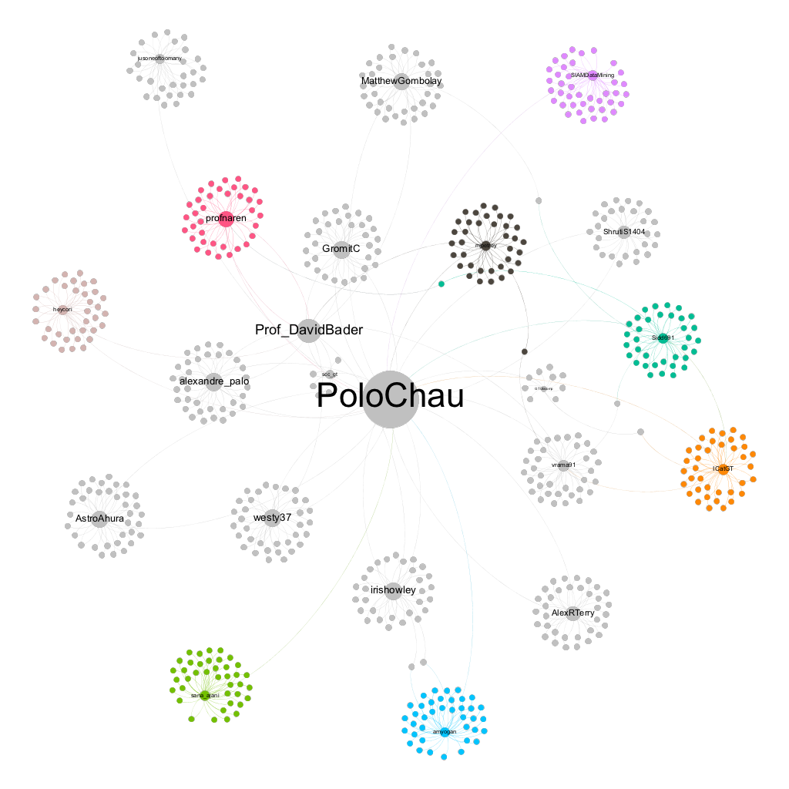
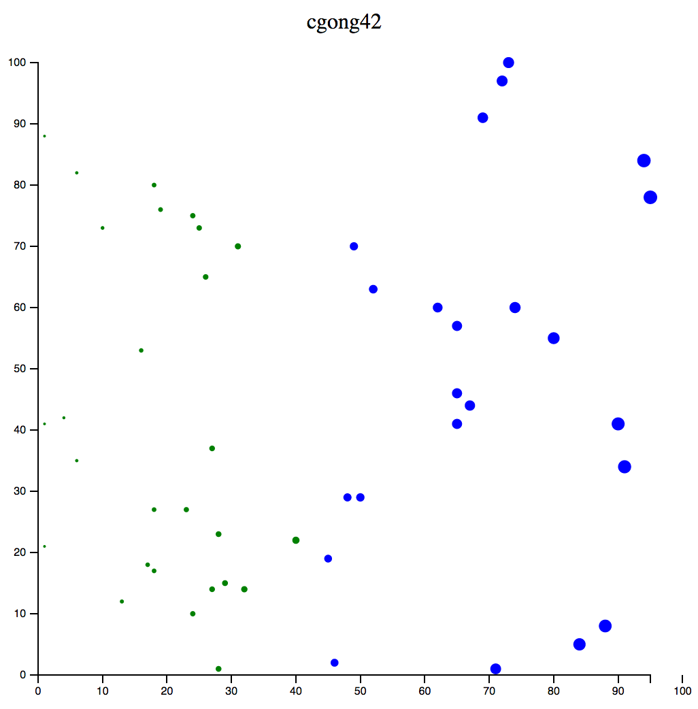

# Analyzing Twitter dataset; SQLite; D3 Warmup; Gephi; OpenRefine

### Q1: Analyzing Twitter dataset

#### Python (2.7)

Use the Twitter REST API to retrieve the first 20 primary friends of PoloChau. From each primary friend, retrieve their first 20 friends and 20 followers on Twitter.

In terminal:

```bash
python script.py
```

This outputs graph.csv with columns source, target.

#### Gephi

Using the graph.csv output, visualize the network of friends and followers obtained using Gephi:



---

### Q2: SQLite

Create an SQLite database called flight_databse.db with data from ```airlines.csv, airports.csv, flights.csv, and movie-overview.txt```

SQL queries are written in ```Q2.SQL.txt``` with output ```Q2.OUT.txt```

---

### Q3: D3 

Scatterplot of 50 randomly generated points with x and y between 0 and 100 inclusively, with radius of point varying by scale.



---

### Q4: OpenRefine

Clean and transform Kaggle's Zillow Prize: Zillow's Home Value Prediction in OpenRefine.
