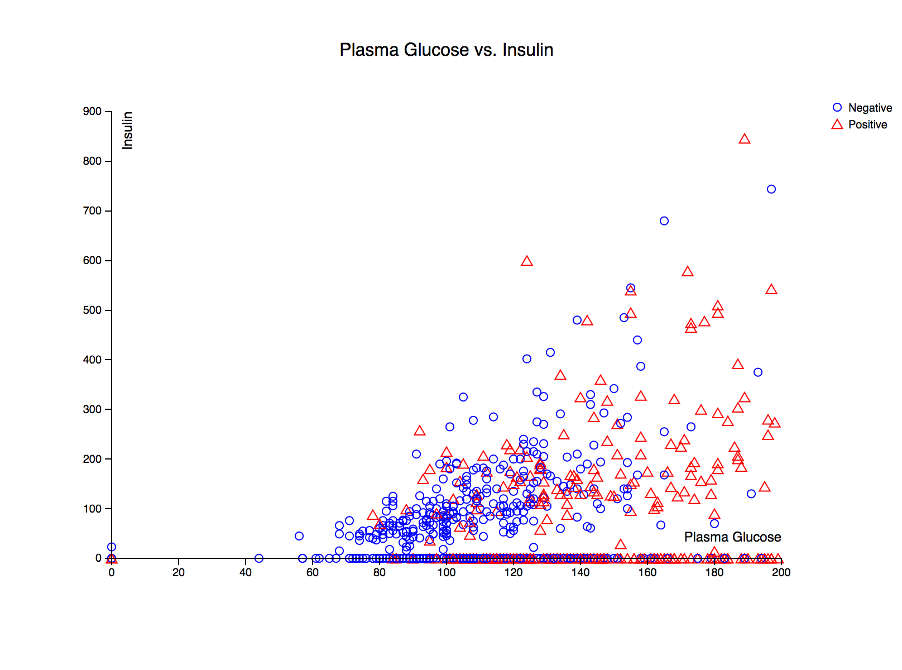
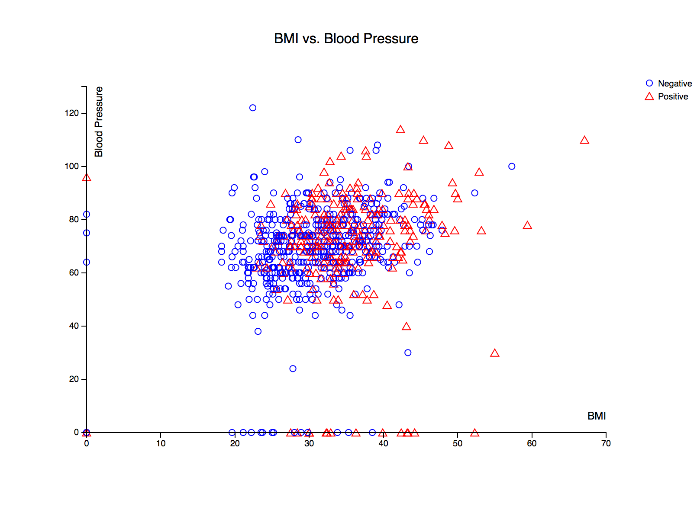
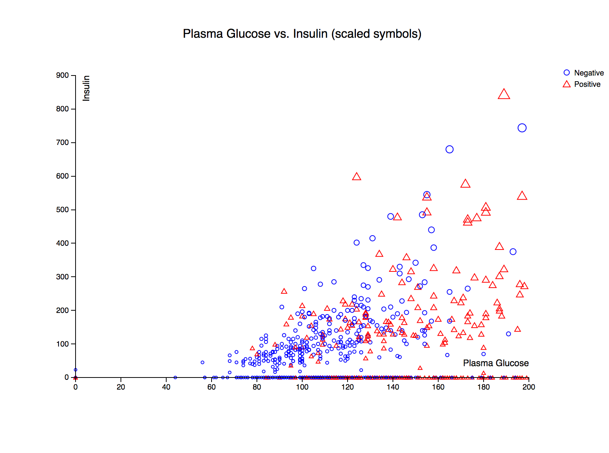
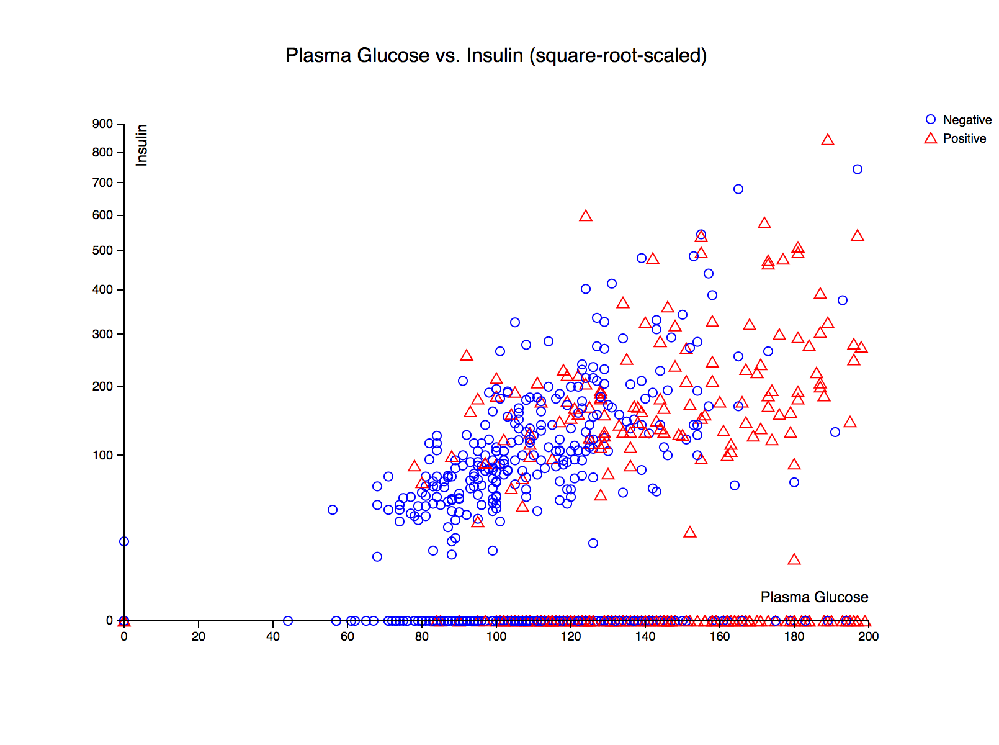
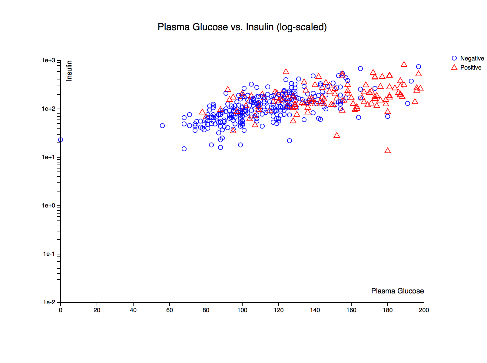
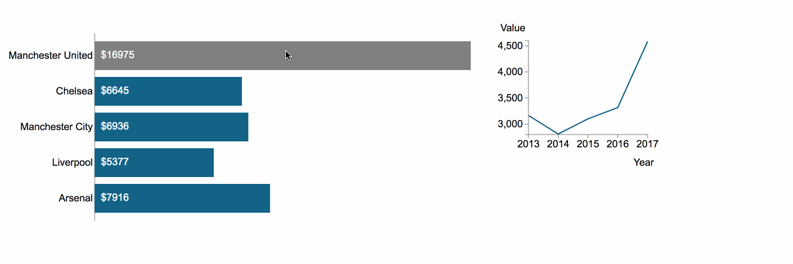
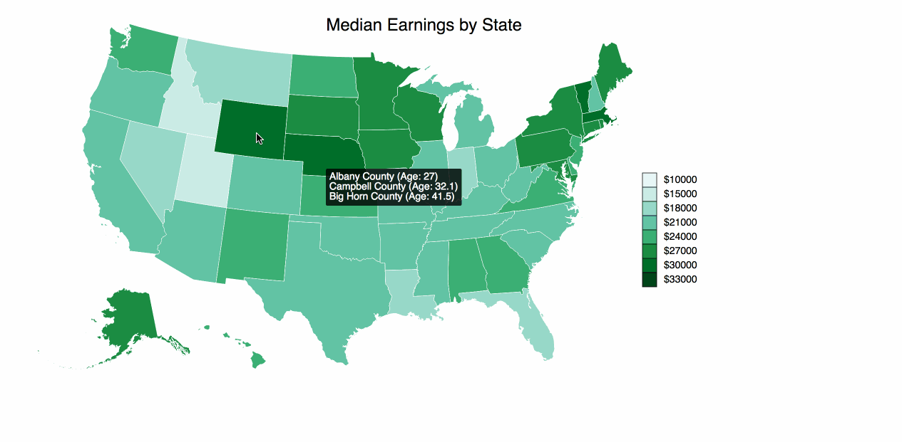

# D3 Graphs and Visualization

### Q1: Designing table and visualizing data with Tableau

Create a good table to display the details of refugees (Total population) in the year 2012 from data provided in ```unhcr_persons_of_concern.csv``` and visualize how different crime rates change over the given year from data provided in ```crime_rates_FBI.csv```.  

Output is in [table.pdf](./Q1/table.pdf) and [timeseries.pdf](./Q1/timeseries.pdf).

---

### Q2: Force-directed in D3

Force-directed graph layout in ```graph.html``` with node labels, colored links based on "value", scaled node sizes, and pinned nodes. 

Output from [graph.html](./Q2/graph.html):


---

### Q3: Scatter plots in D3

Scatter plot using features from the dataset provided in ```diabetes.csv```.  

Output from [scatterplot.html](./Q3/scatterplot.html):

Plasma Glucose vs Insulin:


BMI vs Blood Pressure:


Plasma Glucose vs Insulin (Scaled symbol size proportional to plasma glucose and insulin values):


Plasma Glucose vs Insulin (y-axis square-root-scaled):


Plasma Glucose vs Insulin (y-axis log-scaled):


---

### Q4: Heatmap and Select Box in D3

Heatmap using dataset provided in ```heatmap.csv``` that describes the number of appearances of characters from each house in Game of Thrones across episodes and seasons. Select Box for seasons 1-6. Legend with number of appearances and 9 color gradiations with differing thresholds for each season.

Output from [heatmap.html](./Q4/heatmap.html):


---

### Q5: Interactive Visualization in D3

Horizontal bar chart using dataset provided in ```interactive.html```. Vertical axis denoting Premier League soccer club name and its horizontal axis denoting the total vaues (in millions) over the past 5 years. On hover over a bar, a smaller line chart representing the value of that club for each year (2013-2017).

Output from [interactive.html](./Q5/interactive.html):



---

### Q6: Choropleth Map of County Data in D3

Visualize data from median_ages.csv, us.json, and median_earnings.json as a choropleth map. 

Color of each state and legend corresponds to the median earnings in that state (Darker corresponds to higher median earnings)

On hover, displays tooltip showing 5 counties in that state with the lowest median ages and those ages in ascending order. 

Output from [q6.html](./Q6/q6.html):


